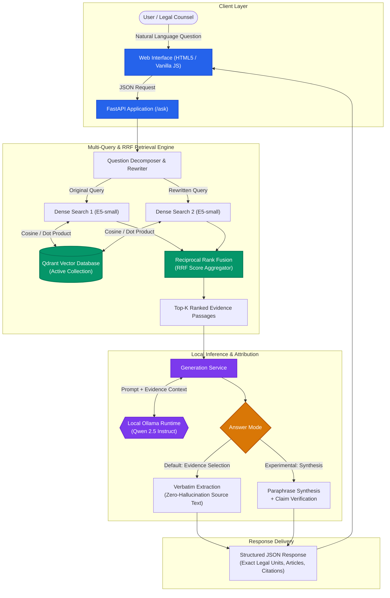
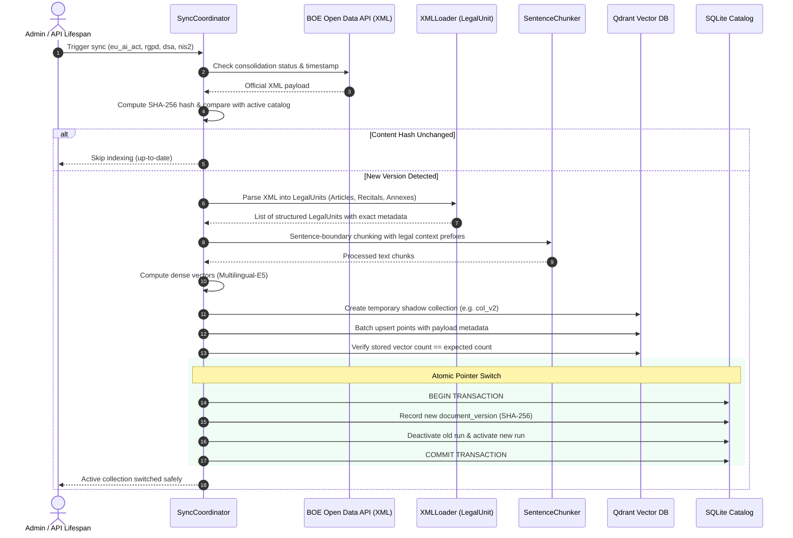

# RAG-Bogado

[](https://github.com/tvarmar/rag-bogado/actions/workflows/ci.yml)
[](https://www.python.org/downloads/release/python-3120/)
[](https://github.com/astral-sh/uv)
[](https://fastapi.tiangolo.com)
[](https://qdrant.tech)
[](https://www.docker.com/)

A production-grade, privacy-first **Retrieval-Augmented Generation (RAG)** system specialized in European and Spanish digital regulation (AI Act, GDPR / LOPDGDD, Digital Services Act, and NIS 2 Directive).

RAG-Bogado bridges the gap between complex legal documents and natural language queries. Built from scratch with native Python 3.12, it eliminates hallucination risks through structured official XML ingestion, deterministic legal unit parsing, multi-query expansion with Reciprocal Rank Fusion (RRF), local vector persistence via Qdrant, and atomic state-machine versioning powered by SQLite.

---

## Table of Contents

- [The Problem: Why Legal Tech RAG is Different](#the-problem-why-legal-tech-rag-is-different)
- [Key Features](#key-features)
- [System Architecture](#system-architecture)
  - [End-to-End Query & Synthesis Pipeline](#end-to-end-query--synthesis-pipeline)
  - [Official BOE Ingestion & Atomic Indexing Pipeline](#official-boe-ingestion--atomic-indexing-pipeline)
- [Technical Rationale & Design Decisions](#technical-rationale--design-decisions)
- [The Official Regulatory Corpus](#the-official-regulatory-corpus)
- [Quickstart & Reproduction](#quickstart--reproduction)
  - [Option A: Local Development with `uv`](#option-a-local-development-with-uv)
  - [Option B: Containerized Execution with Docker Compose](#option-b-containerized-execution-with-docker-compose)
- [Interactive Web Client & REST API](#interactive-web-client--rest-api)
- [CLI Operations & Offline Tools](#cli-operations--offline-tools)
- [Evaluation & Quantitative Benchmarks](#evaluation--quantitative-benchmarks)
- [Project Structure & Documentation Map](#project-structure--documentation-map)

---

## The Problem: Why Legal Tech RAG is Different

Standard RAG architectures designed for generic documentation or customer service chatbots break down when applied to legal and regulatory compliance:

1. **Catastrophic Cost of Hallucinations:** In legal advisory, an invented article number, a fabricated deadline, or a slightly modified clause is not a minor imperfection—it is a legal liability.
2. **Loss of Hierarchy in PDF Parsing:** Off-the-shelf PDF parsers slice documents by arbitrary character counts or physical page boundaries, dissecting articles in half, stripping recital contexts, and losing table hierarchies.
3. **Regulatory Drift:** Legal regulations are consolidated and amended over time. Systems must know exactly which legal version was consulted, verify source hashes, and prevent stale information.
4. **Data Privacy & Leakage:** In-house legal counsels and compliance officers cannot send proprietary risk queries or internal governance questions to third-party public cloud APIs.

**RAG-Bogado addresses each of these challenges by design.**

---

## Key Features

- **Structured Legal Unit Parsing (`LegalUnit`):** Ingests official XML directly from the Spanish Official State Gazette (*Boletín Oficial del Estado* — BOE) and EU Publications Office. Preserves exact semantic boundaries (Recitals, Articles, Paragraphs, Chapters, and Annexes) rather than slicing arbitrary page boundaries.
- **Atomic Blue-Green Versioning:** Ingestion computes SHA-256 content hashes, indexes new vectors into isolated shadow collections in Qdrant, and switches active pointers inside an atomic SQLite transaction only upon full verification.
- **Cross-Corpus Multi-Query Retrieval:** Decomposes complex user queries into sub-queries, executes dual dense retrievals against Multilingual E5 embeddings, and aggregates cross-regulation results using Reciprocal Rank Fusion (RRF).
- **Dual Synthesis Modes with Verbatim Citation Safeguards:**
  - *Evidence Selection Mode (Default):* 100% hallucination-free. The LLM acts purely as a legal selector, identifying exact source IDs while the system presents the original, unadulterated official legal text with verified article numbers.
  - *Synthesis Mode (Experimental):* Generates structured legal summaries backed by an automated claim-by-claim support verification reviewer.
- **Zero Cloud Leakage / Local Offline Runtime:** Runs completely on-premise using an embedded Qdrant vector database and a local quantized LLM (`Qwen 2.5 3B/4B Instruct` via Ollama). Zero external API dependencies, zero subscription costs.
- **Auto-Bootstrapping Lifecycle:** The FastAPI application automatically discovers, starts, monitors, and cleanly shuts down the local Ollama background daemon on server startup and shutdown.

---

## System Architecture

### End-to-End Query & Synthesis Pipeline

The following diagram illustrates the flow from natural language query submission to final citation-backed response:



---

### Official BOE Ingestion & Atomic Indexing Pipeline

Official regulations are ingested with zero manual preprocessing through an automated, fail-safe pipeline:



---

## Technical Rationale & Design Decisions

| Decision | Chosen Approach | Alternative Considered | Engineering Rationale |
|---|---|---|---|
| **Framework Architecture** | **Native Python 3.12 (Zero Frameworks)** | LangChain / LlamaIndex / LangGraph | Off-the-shelf frameworks hide token budgets, introduce breaking abstraction layers, and complicate fine-grained citation validation. Writing pure Python ensures deterministic scoring, transparent context budgets, zero monkey-patching, and lightning-fast CI/test execution (<1.5s for 173 tests). |
| **Document Ingestion** | **Official Structured XML (`xml.etree.ElementTree`)** | PyMuPDF / PDF Plumber | PDFs suffer from column bleeding, inconsistent headers/footers, and arbitrary page breaks that sever legal articles mid-sentence. Official BOE/DOUE XML files provide semantic tags (`<articulo>`, `<considerando>`, `<anexo>`), guaranteeing that every chunk preserves legal context. |
| **Vector Storage** | **Qdrant (Embedded & Client/Server)** | ChromaDB / FAISS / pgvector | Qdrant provides first-class support for payload-based filtering, deterministic point IDs, snapshot persistence on disk, and identical client APIs between local embedded mode (for rapid development/tests) and standalone Docker service. |
| **Catalog State Machine** | **SQLite with Foreign Keys & Partial Unique Indexes** | Filesystem JSON metadata / In-memory state | Vector databases lack transactional ACID guarantees across collections. Using SQLite as the central authority ensures that the active version pointer changes atomically only *after* Qdrant confirms 100% of points are indexed. If indexing crashes, the existing active collection remains intact. |
| **Embedding Model** | **`intfloat/multilingual-e5-small`** | OpenAI `text-embedding-3-small` / BGE-M3 | 384 dimensions allow high-density representation with minimal memory overhead (~300MB RAM), fast local CPU inference, and state-of-the-art multilingual legal retrieval in Spanish and English without sending proprietary data to cloud APIs. |
| **Retrieval Strategy** | **Multi-Query Expansion + Reciprocal Rank Fusion (RRF)** | Single-query Cosine similarity | Users often query in casual terms (e.g., *«¿quién responde por el sesgo en IA?»*). Decomposing the query into a formal legal rewrite expands vocabulary coverage, while RRF balances rank positions without needing uncalibrated score thresholds. |
| **Local LLM Runtime** | **Ollama (`Qwen 2.5 3B / 4B Instruct`)** | Commercial APIs (OpenAI / Anthropic) | Eliminates API costs and guarantees complete data privacy. `Qwen 2.5` excels at structured JSON extraction, multilingual instruction following, and rigorous citation grounding within an 8k context window. |

---

## The Official Regulatory Corpus

RAG-Bogado includes automated synchronization for the complete European digital regulation stack via the Official State Gazette Open Data API:

| Key | Identifier | Regulation Title | Scope & Relevance |
|---|---|---|---|
| `eu_ai_act` | `DOUE-L-2024-81079` | **Reglamento de Inteligencia Artificial (UE 2024/1689)** | High-risk AI categorization, transparency obligations, governance, penalties. |
| `rgpd` | `BOE-A-2018-16673` | **LOPDGDD / RGPD (Ley Orgánica 3/2018)** | Fundamental rights, data protection principles, DPO obligations, user consents. |
| `dsa` | `DOUE-L-2022-81573` | **Reglamento de Servicios Digitales (UE 2022/2065)** | Online intermediary liability, systemic risks, algorithmic transparency. |
| `nis2` | `DOUE-L-2022-81963` | **Directiva de Ciberseguridad NIS 2 (UE 2022/2555)** | Critical infrastructure resilience, incident reporting, cybersecurity compliance. |

---

## Quickstart & Reproduction

### Option A: Local Development with `uv`

Prerequisites: Python 3.12, [`uv`](https://docs.astral.sh/uv/), and [Ollama](https://ollama.com/) (installed locally).

```bash
# 1. Clone the repository
git clone git@github.com:tvarmar/rag-bogado.git
cd rag-bogado

# 2. Synchronize environment and install dependencies
uv sync --locked --python 3.12

# 3. Execute test suite and code quality linters (173 deterministic tests)
uv run pytest
uv run ruff check .
uv run ruff format --check .

# 4. Synchronize the 4 official regulations from BOE (downloads, parses, embeds, and indexes)
uv run python -m rag_bogado.ingestion sync eu_ai_act rgpd dsa nis2

# 5. Start the FastAPI web application (auto-starts Ollama daemon if needed)
uv run uvicorn rag_bogado.api.app:app --host 0.0.0.0 --port 8000 --reload
```

Navigate to `http://localhost:8000` in your browser to interact with the web interface.

---

### Option B: Containerized Execution with Docker Compose

Run the entire stack in isolated containers (FastAPI Web App + Standalone Qdrant Vector Store):

```bash
docker compose up --build
```

Services exposed:
- **Web UI & REST API:** `http://localhost:8000`
- **Qdrant Vector Database:** `http://localhost:6333`

Persistent volumes:
- `./data/qdrant`: Stored dense vector indices.
- `./data/catalog`: SQLite catalog, originals, and metadata.
- `./data/cache/huggingface`: Downloaded embedding model weights.

---

## Interactive Web Client & REST API

The integrated web interface features a responsive, legal-tech dark UI with real-time multi-corpus routing:

- **Corpus Switcher:** Query across the entire consolidated corpus simultaneously (`Todo el corpus (4 normas activas)`) or isolate search to a specific regulation (`eu_ai_act`, `rgpd`, `dsa`, `nis2`).
- **Verbatim Citations:** Every returned answer highlights the exact article, legal unit type, official document title, and direct quote.
- **Dynamic BOE Sync:** Real-time badge indicators displaying active consolidation timestamps and one-click manual synchronization.

### Key API Endpoints

| Method | Path | Description |
|---|---|---|
| `GET` | `/` | Responsive Single-Page Application (HTML5 / Vanilla JS / CSS3). |
| `GET` | `/health` | System health, Ollama availability status, and active document count. |
| `GET` | `/api/documents` | Catalog status of the 4 official regulatory documents. |
| `POST` | `/api/documents/sync` | Triggers background synchronization against the BOE Open Data API. |
| `POST` | `/ask` | Submits a natural language query with multi-query retrieval and citation extraction. |
| `GET` | `/docs` | Interactive Swagger UI (OpenAPI 3.1). |

#### Example Query Request (`POST /ask`)

```bash
curl -X POST http://localhost:8000/ask \
  -H "Content-Type: application/json" \
  -d '{
    "question": "¿Qué obligaciones de transparencia se aplican a los sistemas de IA de riesgo alto?",
    "document_id": "eu_ai_act",
    "answer_mode": "evidence_selection",
    "top_k": 5
  }'
```

#### Example Response Body

```json
{
  "question": "¿Qué obligaciones de transparencia se aplican a los sistemas de IA de riesgo alto?",
  "document_id": "eu_ai_act",
  "answer_mode": "evidence_selection",
  "answers": [
    {
      "question_id": "Q1",
      "question_text": "¿Qué obligaciones de transparencia se aplican a los sistemas de IA de riesgo alto?",
      "status": "answered",
      "selected_source_ids": ["Q1-S1"],
      "answer_text": "Los sistemas de IA de alto riesgo se diseñarán y desarrollarán de tal modo que su funcionamiento sea suficientemente transparente como para permitir que los responsables del despliegue interpreten los resultados del sistema y los utilicen adecuadamente...",
      "citations": [
        {
          "citation_id": "Q1-S1",
          "document_id": "eu_ai_act",
          "document_title": "Reglamento (UE) 2024/1689 (Reglamento de Inteligencia Artificial)",
          "legal_unit_id": "a13",
          "unit_type": "articulo",
          "unit_number": "13",
          "title": "Artículo 13. Transparencia y suministro de información a los responsables del despliegue",
          "page_number": 1,
          "score": 0.8421
        }
      ]
    }
  ],
  "metrics": {
    "total_duration_ms": 312.4,
    "retrieval_duration_ms": 48.2
  }
}
```

---

## CLI Operations & Offline Tools

For automated batch pipelines or headless server operations, RAG-Bogado provides modular CLI utilities:

```bash
# Ingest metadata or synchronize official texts directly from BOE:
uv run python -m rag_bogado.ingestion metadata BOE-A-2018-16673
uv run python -m rag_bogado.ingestion sync eu_ai_act rgpd dsa nis2

# Inspect catalog state, active collections, and indexing failures:
uv run python -m rag_bogado.indexing status
uv run python -m rag_bogado.indexing sync-status --document-id rgpd
uv run python -m rag_bogado.indexing history --document-id eu_ai_act

# Query the active collection from the command line:
uv run python -m rag_bogado.indexing query --document-id eu_ai_act "¿Qué es un sistema de IA de riesgo alto?" --top-k 3

# Run multi-query synthesis with local LLM:
uv run python -m rag_bogado.generation --question "¿Cuáles son las infracciones muy graves en materia de protección de datos?" --document-id rgpd
```

---

## Evaluation & Quantitative Benchmarks

RAG-Bogado includes an integrated evaluation harness located in `src/rag_bogado/evaluation/` to empirically test retrieval accuracy and generation grounding before deploying model updates:

```bash
uv run python -m rag_bogado.evaluation run --dataset eval_dataset_v1.json
```

- **Metrics Tracked:**
  - `Hit@k` (Retrieval recall across gold passages).
  - `MRR@k` (Mean Reciprocal Rank of authoritative legal units).
  - `Abstention Accuracy` (Properly identifying queries outside the corpus scope and rejecting hallucinated claims).
  - `Claim-by-claim Support Rate` (Verifying that 100% of claims in synthesis mode directly match retrieved spans).

Extensive offline benchmarking notes and experimental findings are documented in:
- [Multi-Query Retrieval & RRF Benchmark](docs/multi-query.md)
- [Local LLM Generation & Context Sizing Experiments](docs/local-generation.md)
- [Context Selection & Passage Budget Analysis](docs/context-selection.md)

---

## Project Structure & Documentation Map

```text
rag-bogado/
├── README.md                  # System overview, architecture, quickstart, and API guide
├── PROJECT_PLAN.md            # Detailed milestone roadmap, engineering principles, and scope
├── TODO.md                    # Active session backlog, reproduction commands, and delivery status
├── AGENTS.md                  # Assistant pairing protocol and quality guidelines
├── ESTUDIAR.md                # (Local/Git-ignored) Study notes and technical interview preparation
├── pyproject.toml / uv.lock   # Pinned dependencies and reproducible environment configuration
├── Dockerfile                 # Multi-stage container build with uv and Python 3.12
├── docker-compose.yml         # Containerized FastAPI and standalone Qdrant services
├── .github/workflows/ci.yml   # Continuous Integration pipeline (pytest & Ruff)
├── src/rag_bogado/
│   ├── ingestion/             # boe.py, corpus.py, sync.py, xml_loader.py, chunker.py
│   ├── retrieval/             # vector_store.py (Qdrant adapter), persistent_retriever.py
│   ├── indexing/              # catalog.py (SQLite state machine), service.py, indexer.py
│   ├── generation/            # generator.py, multi_query.py, support.py, structured.py
│   ├── api/                   # app.py (FastAPI & lifespan), schemas.py, static/ (Web UI)
│   └── evaluation/            # metrics.py, runner.py, datasets/, reports/
├── tests/                     # 173 deterministic unit and integration tests
├── scripts/                   # Auxiliary evaluation and local benchmarking scripts
├── docs/                      # Technical whitepapers and architectural experiment notes
└── data/                      # (Git-ignored) Local SQLite catalog, Qdrant indices, and model weights
```

---

## Quality Assurance & Testing

The codebase adheres to strict software engineering standards:
- **100% Deterministic Testing:** The test suite uses synthetic XML fixtures and deterministic mock vectors. Tests execute in ~1.2 seconds without network calls or model downloads:
  ```bash
  uv run pytest
  ```
- **Zero-Warning Code Style:** Enforced by [Ruff](https://docs.astral.sh/ruff/) with strict PEP-8 linting, import sorting, and formatting:
  ```bash
  uv run ruff check .
  uv run ruff format --check .
  ```
- **Automated CI:** Every push and pull request triggers automated GitHub Actions checks against Python 3.12.

---

## License & Attribution

This project is licensed under the MIT License.
Official regulatory texts are sourced from the Open Data services of the [Boletín Oficial del Estado (BOE)](https://www.boe.es/datosabiertos/) and the [Publications Office of the European Union (EUR-Lex)](https://eur-lex.europa.eu/), reused in accordance with public sector information re-use regulations.
